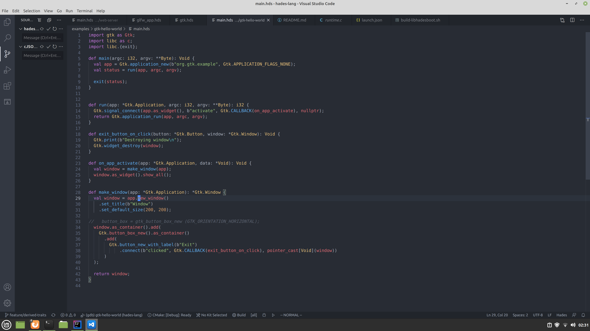

# Hades
 [](https://github.com/dhruvrajvanshi/hades-lang/actions/workflows/ci.yml)
 [](https://codecov.io/github/dhruvrajvanshi/hades-lang)
 
 
A systems level programming language that compiles to LLVM

- [x] Easy interop with C
- [x] Structs
- [x] Generic types
- [x] Extension Methods
- [x] Closures
      - Pure stack allocated closures (i.e. can't be returned from functions and stored in structs right now)
      - Once we have proper destructor semantics, I'll implement heap allocated closures that get cleaned up according to their lifetime.
- [ ] Named function arguments
- [x] Algebraic data types (enums)
- [x] Windows support
- Editor integration
    - Syntax hilighting
        - [x] VSCode
        - [x] Intellij
    - [ ] Error highlighting
    - [ ] Autocompletion
    - [x] Debugger support:
          - Very basic support for gdb and lldb debug symbols is supported. This allows stepping through code using VS code. No local variables are shown yet.

## Intro
Hades is a language that I as an application developer would want to use.
Things that it focuses on
- Ergonomics: Should not be too low level like Rust or C++.
- Interop: Should be easy to bridge to other languages (currently, writing bindings for C is relatively easy).
- Performance: Should still be able to control memory layout to write high performance/allocation free code when required.
- Library oriented: I want the generic system to be like Swift. i.e. by default, generics should be compiled down to regular parameters so that libraries can be separately compiled. As an optimization, the compiler should monomorphize the generic calls if required. Hades doesn't currently work like this. As of now, everything is monomorphized, and there's no way to compile libraries.
- Modern: Algebraic data types, first class closures, 
- IDE features: This is a stretch goal, but I'd like to have an LSP implementation.

## Getting started


### Prerequisites
* Python 3 needs to be installed.
* OpenJDK 11 or later needs to be installed (https://adoptopenjdk.net/ has Java builds for windows).
On Linux, you can usually find `openjdk-11` builds in your package manager (`apt/dnf install openjdk-11`)

### Installation
You can install the latest version of hades using this command
```sh
curl https://raw.githubusercontent.com/dhruvrajvanshi/hades-lang/master/install.py | python3 -
```

On windows, you can run this in prowershell
```powershell
# make sure you've installed python 3 beforehand
(Invoke-webrequest -URI "https://raw.githubusercontent.com/dhruvrajvanshi/hades-lang/master/install.py").Content | python -
```

This will install the latest build from the master branch in ~/.hades/versions/latest/hades (%APPDATA%\hades on windows).
Now, restarting your terminal should put `hades` command on your path.

You can install specific releases by appending `---version <TAG>` to the commands, where `<TAG>` can be replaced with any
[tag version](https://github.com/dhruvrajvanshi/hades-lang/tags) from the releases page. `latest` tag is automatically built when something is pushed to master.


## Development
The current compiler lives under the hadesboot directory (self hosting is a long term goal).

Running the test suite is done using gradle.
```
./gradlew test
```

Building the compiler

```
./gradlew install
```
This installs the compiler executable in hadesboot/target directory. Check out examples directory makefiles
to see how a typical hades binary is built.

## Editor support
Basic syntax hilighting is supported
### IntelliJ
1. Git checkout this repo.
2. Go to `File > Settings > Editor > TextMate bundles`
3. Add a new bundle from directory `ide/vscode-hades`.
You should now get basic syntax hilighting for .hds files.

### VS Code
Plugin isn't published yet. It's in `ide/vscode-hades` Figure it out.
Instructions to come in the future.

## Hello world
```scala
extern fn puts(*u8): Void = puts // by default, programs are linked with libc. This means you can declare pre-existing C functions as extern
fn main(): Void {
    puts(c"Hello world");
}
```

Local variables
```scala

fn main(): Void {
  val x: *Byte = c"Hello world"; // the type annotation can be omitted
  c.puts(x);
}

```

## Some bindings for a C library



## A bigger example

```scala
// A struct has a packed layout like C
struct Pair[A, B] {
  val first: A;
  val second: B;
}

fn main(): Void {
  if true {
    val pair = Pair(1, c"text"); // Type arguments to Pair are inferred
    print_pair_second(pair); // function arguments are passed as value (a copy of pair is sent to print_pair
    val pair_ptr = &pair; // you can take address of local variables and pass them as pointers
    pair.print_second(); // this is an extension function call

    val mut_pair_ptr = &mut pair // taking a mutable pointer
    puts(mut_pair_ptr.second) // calling dot on a pointer dereferences it
    val second_field_ptr = &pair.second // we can get a field offset using &stuctval.field
    mut_pair_ptr.second = c"value" // dereferencing dot operator works for assignments as well
  }
}

fn print_pair_second[T](pair: Pair[T, *Byte]): Void {
  c.puts(pair.second);
}

// extension methods can be defined for any type including types from
// different libraries

// some/nested_module.hds
extension PairExtensions[T] for Pair[T, *Byte] {
    // `*this` means this extension takes its receiver by pointer
    // Use `*mut this` to treat receiver pointer as mutable
    // and `this` to take it as value
    fn print_second(*this): Void {
      c.puts(this.second); // Unlike this.second on a pointer to a struct is equivalent to this->second in C
    }
}

// in another file

// Importing a module brings extensions exported by that module
// into scope. This isn't transitive i.e. extensions imported by
// nested_module would not be available here. You have to separately
// import those.
import some.nested_module as nested_module;

fn main(): Void {
    val x = Pair(true, c"x");
    // because extension method is declared as *this,
    // we have to take pointer to x to pass it to the method.
    (&x).print_second();
}
```

## Enum types
Enum types (also known as algebraic data types) allow you to represent types that can be one of a finite set
of cases.
```scala

enum Optional[T] {
  Some(value: T);
  None;
}
/// This compiles down to the equivalent of this (the names are mangled so
/// this isn't valid hades source code, but they are equivalent
/// struct Optional[T] {
///    val tag: u8
///    val payload: Union[Optional.Some[T], Optional.None]
/// }
/// struct Optional.Some[T] {
///   val 0: T
/// }
/// const Optional.Some.tag : u8 = 0
/// struct Optional.None[T] {}
/// const Optional.None.tag : u8 = 1

/// Optional.Some[u32](1) ~ Optional[u32](Optional.Some.tag, Optional.Some(1))
/// Optional.None[u32] ~ Optional[u32](Optional.None.tag)


fn main(): Void {
   // Enum types can be pattern matched on.
   // The cases are checked at compile time. If you
   // decide to add a new case, that will have to
   // be handled in existing match statements.
   val ten = match Optional.Some(10) {
      // notice the use of `val` keyword to disambiguate enum case names
      // from parameter binding patterns. 
      // this is different from rust, where patterns can be qualified,
      // haskell, where data Cases have to start with uppercase (I think?)
      // and swift where constructor cases are prefixed with a `.` to distinguish
      // from bound patterns.
      // An explicit `val` keyword has an added advantage of being easily searchable. 
      Some(val value) -> value,
      None -> 0
   };
   val zero = match Optional.None[Int] {
     Some(val value) -> value,
     None -> 0
   };
}
```

Enums don't have to carry extra data.

```
// The underlying representation of an enum tag is
// u8 (8 bit unsigned integer)
enum Token {
    Identifier
    Number
    String
}
```
This will be similar to a C style enum (except more type safe because you can't assign itegers to them)

## Closures
Hades supports a limited form of closures that are allocated on the stack. This means that
they can't be returned from functions or stored in structs.
Once proper destruction and move semantics are implemented, this restriction can be lifted by
heap allocated closures.
```scala

fn main(): Void {
  puts(apply(true, |value| if (value) c"true" else c"false")); // prints "true"
  // closures can have a block body
  // prints "Done"
  puts(apply(true, |value| {
    if value {
      return c"Done";
    } else {
      return c"Not done";
    }
  });
}

fn apply[T, U](arg: T, fn: |T| -> U): U {
  return fn(arg);
}
```

## Misc
Check the suite directory for a few contrived examples used as an automated test suite.
There's a gtk-hello-world which is a good representative program.
Proper documentation coming in the future.

